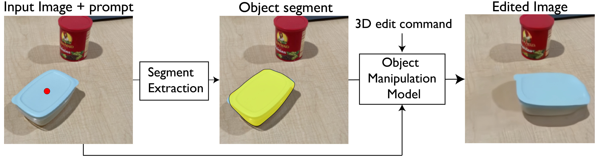
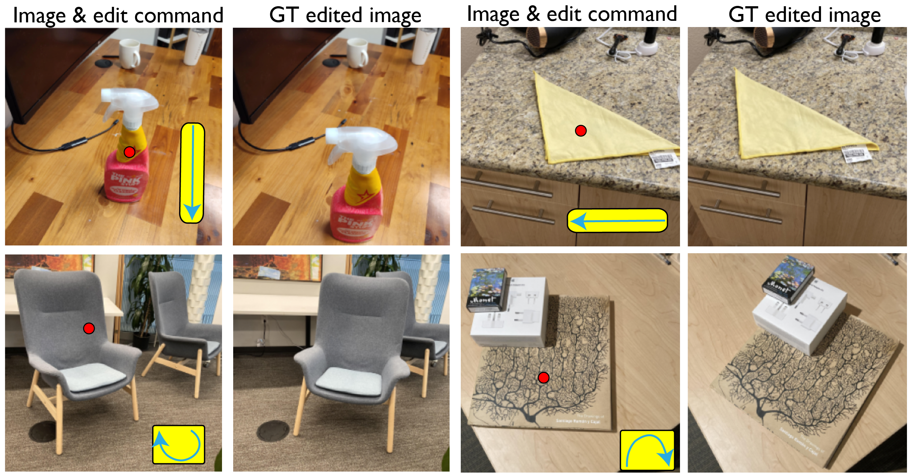
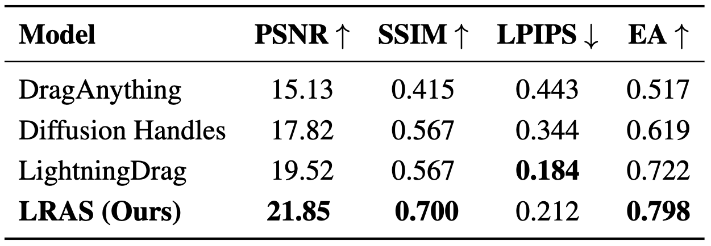

<div align="center">
<h2> 3DEditBench: benchmakring 3D object editing </h2>

[**Rahul Venkatesh***](https://rahulvenkk.github.io/)<sup>1</sup> · [**Wanhee Lee***](https://scholar.google.com/citations?user=BdHgmrUAAAAJ&hl=ko) · [**Klemen Kotar***](https://klemenkotar.github.io/)<sup>1</sup> · [**Khai Loong Aw***](https://arc.net/l/quote/bawwtxnk)<sup>1</sup> · 

[**Jared Watrous**](https://www.linkedin.com/in/jared-watrous)<sup>1</sup> ·  [**Honglin Chen**](https://x.com/honglin_c?lang=en)<sup>2</sup>  ·   [**Stefan Stojanov**](https://sstojanov.github.io/)<sup>1</sup> ·  [**Daniel L. K. Yamins**](https://stanford.edu/~yamins/)<sup>1</sup>

<sup>1</sup>Stanford, &emsp;&emsp;&emsp;&emsp;<sup>2</sup>OpenAI,&emsp;&emsp;&emsp;&emsp;*equal contribution

[//]: # (<a href="https://neuroailab.github.io/spelke_net/"></a>)

[//]: # (<a href='https://neuroailab.github.io/spelke_net/'></a>)
</div>


## Standard pipeline for 3D object manipulation
In standard 3D object manipulation pipelines, an input image is paired with a user-defined edit prompt—specifying a 3D transformation—and a 2D point indicating the target object. Most models first infer an object mask from this point, which guides where the transformation should be applied in the scene.



## The 3DEditBench benchmark
To evaluate performance on this task, **3DEditBench** provides real-world image pairs with ground-truth 3D transformations, which are obtained by annotating sparse correspondences between image pairs, unprojecting them to 3D, and solving for the transform via least-squares. As shown below, the dataset includes a wide range of object types—such as cloth, stacked objects, and rigid bodies—and captures transformations involving rotation, translation, depth changes, and occlusion.



## Getting Started

### Setting up the Conda environment to use 3DEditBench ###

```bash
conda create -n 3d_edit_bench python=3.10 -y
conda activate 3d_edit_bench
pip install -e .
```
### Download the dataset

To download the dataset, run the following command to download it into the `datasets/` folder.:

```bash
cd 3DEditBench
bash download_3d_edit_bench.sh
```

### Visualization using jupyter notebooks

We also provide Jupyter notebooks for visualizing the data. Please check the `notebooks` directory for [examples](https://github.com/neuroailab/3DEditBench/blob/main/notebooks/data_visualization.ipynb).


## Data Description

The dataset is provided in the HDF5 format. Each file contains a dictionary-like object with the following keys.

| Key                    | Shape             | Description                                                                                                                       |
|------------------------|-------------------|-----------------------------------------------------------------------------------------------------------------------------------|
| `image1`               | `(1024, 1024, 3)` | Input image (cropped to square).                                                                                                  |
| `image2`               | `(1024, 1024, 3)` | GT edited image (cropped to square).                                                                                              |
| `K`                    | `(3, 3)`          | Camera intrinsic matrix                                                                                                           |
| `R`                    | `(3, 3)`          | Ground-truth 3D rotation                                                                                                          |
| `T`                    | `(3,)`            | Ground-truth 3D translation                                                                                                       |
| `object_points_image1` | `(N, 2)`          | Manually annotated 2D keypoints in `image1`, corresponding to the object being manipulated.                                       |
| `object_points_image2` | `(N, 2)`          | Manually annotated 2D keypoints in `image2`, corresponding to the same object.                                                    |
| `ground_points_image1` | `(3, 2)`          | 2D points on the supporting surface (e.g. desk/floor) in `image1`. Useful for specifying transformations in world coordinates.    |
| `point_prompt`         | `(2,)`            | A single 2D point in `image1` indicating the object to be manipulated. Typically used as input to segmentation or editing models. |
| `GT_segment`           | `(1024, 1024)`    | Ground-truth segmentation mask for the object being manipulated in `image1`.                                                      |


Note: The GT 3D transformations, R and T are specified in camera coordinates. We use the `OpenCV` format i.e `(X-Right, Y-Down, Z-Front)` for the camera coordinate system. 


## Evaluating your own model on 3DEditBench

`3DEditBench` provides tools to evaluate object editing models using real-world paired image data with known 3D transformations.

> ⚠️ **Note:** The evaluation scripts (e.g. `editbench-launch`, `editbench-evaluate-metrics`) are provided by the [3DEditBench repository](https://github.com/neuroailab/3DEditBench), but can be run from **your own model repository**. You only need to install the 3DEditBench package to gain access to these command-line utilities.

### Step 1: Implement the Model Interface

In your model repository, define a model class that **inherits from**: [`edit_bench.models.object_edit_class.ObjectEditingModel`](https://github.com/neuroailab/3DEditBench/blob/main/edit_bench/models/object_edit_class.py#L2)

You must implement the `run_forward` method with the following signature:

```python
class YourEditingModel(ObjectEditingModel):
    def __init__(self):
        pass

    def run_forward(self, image, image_id, point_prompt, R, T, K, gt_segment):
        """
        Args:
            image:        [H, W, 3] uint8 RGB image
            image_id:     Unique identifier (string)
            point_prompt: [2,] point (x, y) indicating where to apply the edit
            R, T:         Ground-truth 3D rotation & translation
            K:            Camera intrinsics [3, 3]
            gt_segment:   Binary mask [H, W] for object segmentation
        Returns:
            edited_image: Edited RGB image [H, W, 3], uint8
        """
```

### Step 2: Install the evaluation tools

Clone and install the `3DEditBench` repository in your environment:

```bash
conda activate your_env  # Activate your conda environment
git clone https://github.com/neuroailab/3DEditBench.git
cd 3DEditBench
pip install -e .
```

This makes the `editbench-launch` and `editbench-evaluate-metrics` commands available system-wide.

### Step 3: Download the Dataset

Download and extract the dataset to a location of your choice (e.g., `datasets/3DEditBench/`):

```bash
bash download_3d_edit_bench.sh
```

This script saves the dataset in `./datasets/3DEditBench` by default. You can change this path if needed—just make sure to update `--dataset_path` accordingly in the next step.


### Step 4: Parallel Inference on a Multi-Node Cluster

To run inference **in parallel across multiple nodes and GPUs**, we provide a wrapper script that splits the dataset and distributes it across workers.

Assume:
- You have **4 nodes**, each with **4 GPUs**
- You want to split the workload evenly across the nodes

Then on **each node**, run the following command with the appropriate `--split_num` (ranging from `0` to `3`):

```bash
editbench-launch 
  --gpus 0 1 2 3 \
  --dataset_path ./datasets/3DEditBench \
  --output_dir ./experiments/my_model_run \
  --num_splits 4 \
  --split_num <node_id> \
  --model_class your_model.YourEditingModel
```

Replace `<node_id>` with the ID of the current node (e.g., `0`, `1`, `2`, or `3`).


| Flag             | Description                                                                 |
|------------------|-----------------------------------------------------------------------------|
| `--gpus`         | List of GPU IDs to use on this node (e.g., `0 1 2 3`)                       |
| `--dataset_path` | Path to the 3DEditBench dataset                                             |
| `--output_dir`   | Directory to save predictions and visualizations                            |
| `--num_splits`   | Total number of splits (typically equal to number of nodes)                 |
| `--split_num`    | Index of the current split (i.e., node ID)                                  |
| `--model_name`   | Full Python path to your model class (e.g., `your_model.YourEditingModel`)  |


### Step 5: Evaluate Aggregate Metrics

Once inference is complete, you can evaluate your model’s performance by aggregating metrics:

```bash
editbench-evaluate-metrics \
  --predictions_path ./experiments/my_model_run/hdf5_result_files
```

This command prints out the average metrics (MSE, PSNR, SSIM, LPIPS, and Edit Adherence) across all evaluated samples.

> 📌 Note: A reference implementation of the ObjectEditingModel class is provided in the [SplekeNet repository](https://github.com/neuroailab/SpelkeNet/tree/main?tab=readme-ov-file#-using-spelke-segments-for-object-manupulation)

<p align="center">
  
</p>

---

## Collecting your own data

We will release the data collection pipeline soon and would love for the community to contribute more data to this benchmark.

---

## Citation
If you use this dataset in your research, please cite our papers:

```bibtex
@article{lee20253d,
  title={3D Scene Understanding Through Local Random Access Sequence Modeling},
  author={Lee, Wanhee and Kotar, Klemen and Venkatesh, Rahul Mysore and Watrous, Jared and Chen, Honglin and Aw, Khai Loong and Yamins, Daniel LK},
  journal={arXiv preprint arXiv:2504.03875},
  year={2025}
}

@misc{venkatesh2025discoveringusingspelkesegments,
      title={Discovering and using Spelke segments}, 
      author={Rahul Venkatesh and Klemen Kotar and Lilian Naing Chen and Seungwoo Kim and Luca Thomas Wheeler and Jared Watrous and Ashley Xu and Gia Ancone and Wanhee Lee and Honglin Chen and Daniel Bear and Stefan Stojanov and Daniel Yamins},
      year={2025},
      eprint={2507.16038},
      archivePrefix={arXiv},
      primaryClass={cs.CV},
      url={https://arxiv.org/abs/2507.16038}, 
}
```